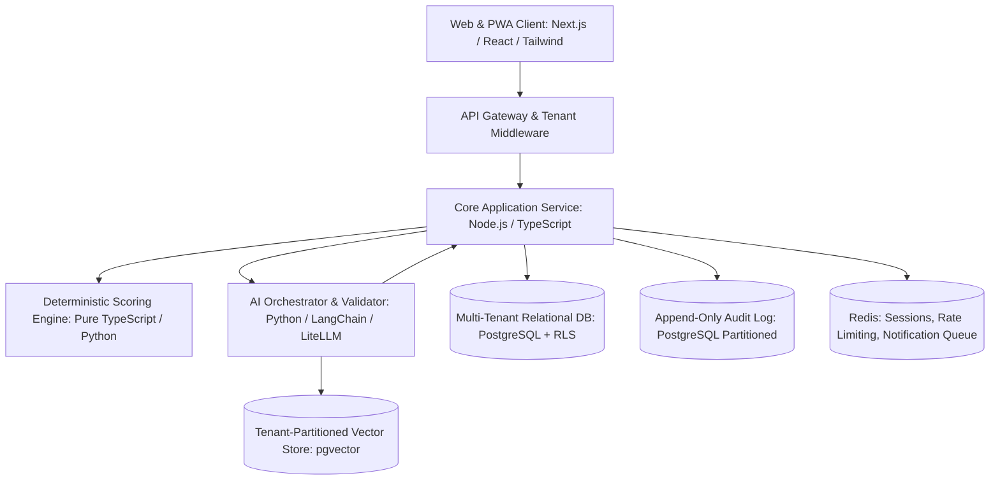

# SWEEP Care AI — Comprehensive Phased Implementation Plan

**Document Version:** 1.0  
**Baseline Reference:** SWEEP Care AI PRD v1.0 (7 October 2026)  
**Status:** Approved Engineering Blueprint  
**Primary Product Loop:** Assess → Understand → Design → Act → Measure → Improve  

---

## Executive Summary & Architectural Strategy

SWEEP Care AI is a white-label, multi-tenant Wellbeing Intelligence and Programme Design Platform. It provides an organizational infrastructure layer connecting self-assessments, privacy-preserving population intelligence, grounded AI-assisted programme design, human delivery, and longitudinal outcome measurement.

This implementation plan translates the **22 Development Epics** and **Build Sequence (§120)** of the PRD into an execution roadmap. It adheres strictly to the **Build Agent Constitution (§105)** and **PRD Integrity Protocol (§2)**:
1. **CONFIRMED** requirements are implemented without modification.
2. **RECOMMENDED** patterns are specified as standard engineering best practices.
3. **TBDs** are isolated into configurable parameters or safe defaults, never fabricated as hardcoded values.
4. **PROHIBITED** behaviors (autonomous diagnosis, employee surveillance, fabricated citations, ungrounded LLM scoring, facial/voice emotion analysis) are architecturally excluded.

---

## Technology Stack & Architecture Baseline

To satisfy multi-tenancy, deterministic scoring, strict auditability, and grounded AI orchestration, the recommended baseline stack is:

- **Frontend / Client Experience:** Next.js (App Router, TypeScript, Tailwind CSS, shadcn/ui, Accessible WCAG 2.2 AA components).
- **Backend Services:** Node.js / TypeScript or Python FastAPI for core domain APIs; stateless, deterministic micro-modules for scoring.
- **Data Persistence & Isolation:** PostgreSQL with **Row-Level Security (RLS)** strictly enforcing `tenant_id` at the database engine level (AC-001, Rule 12).
- **Vector Search / Knowledge Store:** `pgvector` or managed vector store isolated by tenant namespace and knowledge source classification (Class A vs Class B).
- **Audit Logging:** Append-only structured event log with HMAC/cryptographic tamper detection for Class D, E, and F data (AC-009, §55).
- **AI Orchestrator:** Isolated service layer enforcing schema validation (Pydantic / Zod), source citation verification, safety guardrails, and model version provenance (AC-004, AC-005, §73, §75).

---

## Phase Overview Roadmap

| Phase | Focus | Scope | Key Milestone |
|---|---|---|---|
| **Phase 0** | **Engineering Baseline & Environment** | CI/CD, Git repo, DB migration framework, Tenant RLS, Linters | Baseline architecture ready |
| **Phase 1** | **Core Wellbeing Intelligence (MVP)** | Epics 01 to 22 (§97, §102 Core Acceptance Flow) | End-to-end 16-step user journey functional |
| **Phase 2** | **Professional Workflows & Integrations** | Case notes, Referrals, Participant Assistant, SSO/LMS, Localization | Professional care teams & enterprise connectors |
| **Phase 3** | **Optional Physiological Data & Compliance** | Wearables/Health readings, Stronger data residency, Regulated workflows | Contextual health signals with strict privacy |
| **Phase 4** | **Outcome Intelligence Network** | Governed, de-identified cross-tenant outcome learning | Global evidence-based intervention benchmarking |

---

## Detailed Implementation Breakdown: Phase 1 (MVP)

Phase 1 delivers the full Core Product Loop (**Assess → Understand → Design → Act → Measure → Improve**) and fulfills the 16 steps of the **Core Acceptance Flow (§102)**.

---

### Sprint 1.1 — Foundations, Tenancy & Identity (EPIC 01, EPIC 20)
* **Objective:** Establish rock-solid tenant isolation, authentication, and role-based access control.
* **Requirements:**
  - Multi-tenant data model with `tenant_id` on every organizational entity.
  - PostgreSQL Row-Level Security (RLS) policies enforcing zero cross-tenant leakage (**AC-001**).
  - RBAC engine supporting 7 core roles: Super Admin, Org Admin, Wellbeing Professional, HR/People Manager, Trainer/Facilitator, Participant, Safeguarding Officer (§11–17).
  - Minimum Necessary Visibility: HR/People Manager role blocked from raw Class D/E/F data by default (§14, §55).
  - Cryptographic session management and audit logging event pipeline.
* **TBD Handling:** Set default password/session timeout policy to secure defaults (§85).

### Sprint 1.2 — White-Label Engine & Organization Structure (EPIC 02, EPIC 03)
* **Objective:** Allow organizations to brand their instance and define flexible organizational hierarchies.
* **Requirements:**
  - White-Label Configuration: logo, display name, brand colors, typography, email templates, support contact, terms, privacy notices (§19).
  - Configurable "Powered by SWEEP Care AI" badge toggle (§19).
  - Sector terminology mapping: School (Students/Classes), Church (Members/Ministries), Corporate (Employees/Teams), Training (Learners/Cohorts) (§20).
  - Hierarchical Organization Units: N-tier tree structure (Region → Location → Department → Team or Faculty → Dept → Program) (§22).

### Sprint 1.3 — Participant Onboarding, Consent Centre & Privacy by Design (EPIC 04, EPIC 20)
* **Objective:** Provide a transparent consent workflow and participant profile management.
* **Requirements:**
  - Participant invitation, signup, and profile setup.
  - Interactive Consent Centre (§58) answering: What is collected, Why, Who accesses it, and Permission status.
  - Data classification enforcement (Class A through F) with tiered access controls (§55).
  - Age-verification gate with minor safeguarding flags (**TBD-LEGAL-001** isolated via configuration) (§59).

### Sprint 1.4 — Assessment Authoring & Campaigns (EPIC 05, EPIC 06)
* **Objective:** Build the versioned assessment builder and campaign distribution system.
* **Requirements:**
  - Versioned Assessment Builder: Domains, sections, questions, logic rules, optional/required flags (§23, §24).
  - Supported question types: Likert scale, single choice, multiple choice, numeric, yes/no, short/long text, slider, date, matrix (§24).
  - **Assessment Immutability (AC-002, §28):** Historic published assessments with responses are completely frozen. Any edit creates a new immutable version.
  - Assessment Catalog & Templates (§26, §27): External validated vs Custom organization-created tags with mandatory source metadata.
  - Campaign Manager (§29): Target cohorts, schedules, reminder cadence, anonymous vs identified mode, cohort thresholds.

### Sprint 1.5 — Participant Assessment UX & Deterministic Scoring Engine (EPIC 07, EPIC 08)
* **Objective:** Deliver responsive mobile-first assessment completion and deterministic algorithmic scoring.
* **Requirements:**
  - Participant Assessment Experience: Mobile-optimized, auto-saving drafts, low-bandwidth resilience (§30, §91).
  - **Deterministic Scoring Engine (AC-003, §33, Rule 4):**
    - Executed entirely in compiled deterministic code.
    - **PROHIBITED:** LLM calculation of scores, percentiles, or thresholds.
    - Scoring algorithms versioned alongside assessments. Same responses + same scoring version = identical score guaranteed.
  - Composite SWEEP Wellbeing Profile generator (**TBD-CLIN-001** isolated behind modular pluggable scoring strategies) (§32).

### Sprint 1.6 — Wellbeing Profiles & Small-Group Protected Population Analytics (EPIC 09, EPIC 10)
* **Objective:** Render individual personal profiles and privacy-preserving aggregate population dashboards.
* **Requirements:**
  - Personal Wellbeing Profile (§34): Explicitly distinguishes DATA (reported), CALCULATION (scored), INTERPRETATION (inferred), and RECOMMENDATIONS (actions).
  - Population Intelligence Dashboard (§35, §63): Aggregated domain trends, participation rates, longitudinal shifts.
  - **Small-Group Privacy Engine (AC-001, §36):**
    - Enforces minimum cohort threshold $K$ (**TBD-PRIV-001**, default safe value $K=10$, configurable).
    - Automatic cell suppression, category hiding, and anti-differencing filter controls to prevent re-identification.
  - Segmentation by permitted organizational units (§37).

### Sprint 1.7 — Knowledge-Grounded AI Orchestrator & RAG Architecture (EPIC 11, EPIC 12)
* **Objective:** Build the anti-hallucination AI subsystem for interpreting population findings.
* **Requirements:**
  - Multi-component AI Orchestrator (§73): Separated into Interpretation, Knowledge Retrieval, and Output Validator.
  - Task Risk Classifier (§74): Low, Moderate, High risk classification.
  - **10 Anti-Hallucination Guardrails (§75):**
    - Rule 1: Grounded factual outputs via approved knowledge sources.
    - Rule 2: Citation traceability (**AC-005**). Unverified citations fail validation.
    - Rule 3: Refusal to fabricate certainty when evidence is missing.
    - Rule 4: Deterministic facts stay in code.
    - Rule 5: Strict JSON Schema validation (Pydantic / Zod).
    - Rule 6: No LLM-generated citation IDs.
    - Rule 7: Separate retrieved facts from synthesis.
    - Rule 8: No artificial confidence scores ("93% confident" prohibited).
    - Rule 9: Unknown stays unknown.
    - Rule 10: Strict prompt injection sanitization on all user inputs.
  - AI Transparency (**AC-010, §49**): Explicit badges and disclaimers on all AI-assisted views.
  - AI Output Provenance (**AC-004, §57**): Logs model version, prompt version, retrieved source IDs, and output hashes.

### Sprint 1.8 — AI Programme Design Engine & Human Approval Workflow (EPIC 13, EPIC 14)
* **Objective:** Enable one-click drafting of targeted interventions from assessment findings with mandatory human review.
* **Requirements:**
  - "Design Programme from Findings" generator (§39): Converts population gaps and priority themes into structured intervention drafts.
  - Knowledge grounding (§40, §41): Uses approved frameworks; labels drafts as "Suggested programme approach", never "Proven intervention" unless grounded in verified clinical literature.
  - Programme Builder (§42): Objectives, session timelines, resource links, facilitator assignment, baseline and target outcome measures.
  - **Human Review Gate (AC-006, §43, §78):**
    - State lifecycle: `DRAFT` → `UNDER_REVIEW` → `APPROVED` → `SCHEDULED` → `ACTIVE` → `COMPLETED` → `OUTCOME_REVIEW` → `ARCHIVED`.
    - AI-generated programmes start in `DRAFT`. Direct publication without authorized human approval is blocked in the data layer.

### Sprint 1.9 — Programme Delivery & Baseline/Follow-Up Tracking (EPIC 15, EPIC 16)
* **Objective:** Manage participant enrollment, facilitator sessions, and scheduled reassessment.
* **Requirements:**
  - Participant enrollment, attendance tracking, session completion, and reflection submissions (§44).
  - Facilitator dashboard: Session materials, attendance records, milestone check-ins (§44, §66).
  - Pre/Post Assessment Trigger: Automatic dispatch of follow-up campaigns tied directly to the baseline assessment instrument version (§45).

### Sprint 1.10 — Outcome Measurement & Impact Reporting (EPIC 16, EPIC 17)
* **Objective:** Calculate domain-level change and generate executive and stakeholder impact reports.
* **Requirements:**
  - Longitudinal Outcome Engine (§45): Compares baseline vs post-intervention scores across cohorts.
  - Non-Causal Language Guardrail (§45): Explicitly reports observed average improvements; prevents unjustified causal assertions.
  - Multi-Audience Impact Reports (§46): Executive wellbeing report, programme impact report, cohort analysis, donor/funder report.
  - Metadata labeling: Sample size, participation rate, assessment versions, method limitations, AI contribution tags, human reviewer sign-off.

### Sprint 1.11 — Notifications, Global Crisis Support & Safeguarding Layer (EPIC 18, EPIC 19)
* **Objective:** Deliver multi-channel notifications and a deterministic safety escalation layer.
* **Requirements:**
  - Notification Engine (§72): Assessment invites, reminders, programme updates without leaking sensitive wellbeing data in previews.
  - Safeguarding & Safety Architecture (§60):
    - Independent deterministic safety rule evaluation triggered on specific response flags or free-text triggers.
    - Escalation policy execution notifying Designated Safeguarding Officers (§17).
  - Global Crisis Support Configurator (§61): Per-tenant, per-region configurable emergency lines, internal support contacts, and crisis resources. No hardcoded global emergency numbers.

### Sprint 1.12 — Administration, Telemetry & AI Evaluation Suite (EPIC 21, EPIC 22)
* **Objective:** Equip super administrators with system telemetry and deploy the automated anti-hallucination QA suite.
* **Requirements:**
  - Super Administrator Console (§11): Tenant management, global template catalog, AI model configuration, feature flags, operational audit inspection.
  - **AI Hallucination QA Test Suite (§104):** Automated regression tests asserting refusals against:
    - Fabricated studies/citations.
    - Individual clinical diagnoses.
    - Workplace disciplinary/firing advice.
    - Overriding safety rules via prompt injection.
  - Performance & autosave verification (§93, §94).

---

## Acceptance Criteria Verification Matrix (MVP)

| Criteria | PRD Ref | Implementation Verification Mechanism |
|---|---|---|
| **AC-001: Tenant Isolation** | §103, §18 | Automated API test: Tenant A token rejected when requesting Tenant B entities via UUID or search. PostgreSQL RLS unit tests. |
| **AC-002: Assessment Immutability** | §103, §28 | Automated test: Submitting responses to Assessment v1 locks v1. Updating assessment creates v2 without altering v1 history. |
| **AC-003: Deterministic Scoring** | §103, §33 | Pure unit tests: Same inputs into scoring algorithm yield exact bit-identical score across 1,000 runs. No LLM invoked. |
| **AC-004: AI Provenance** | §103, §57 | DB Schema test: Every `AIArtifact` row contains `model_version`, `prompt_version`, `sources_retrieved`, and `created_at`. |
| **AC-005: Unsupported Evidence** | §103, §75 | Evaluation test: When querying an empty or irrelevant knowledge base, the model asserts "no verified source" rather than hallucinating citations. |
| **AC-006: Human Approval** | §103, §43 | State machine test: State transition `DRAFT` → `ACTIVE` without `HUMAN_APPROVED` status throws 403 Forbidden. |
| **AC-007: Health Privacy** | §103, §14, §53 | RBAC test: HR Manager role receives 403 when requesting individual assessment responses or Class E health measurements. |
| **AC-008: Consent Gate** | §103, §58 | Integration test: Assessment submission or optional data sync fails if active `ConsentRecord` is absent or expired. |
| **AC-009: Auditability** | §103, §85 | Audit log test: Querying Class D/E/F records writes an immutable `AuditEvent` entry with actor ID, timestamp, and scope. |
| **AC-010: AI Disclosure** | §103, §49 | UI Component test: All AI-generated outputs render with explicit disclosure tags and safety disclaimers. |

---

## Phase 2: Professional Workflows & Integrations

1. **Professional Case Management & Referrals (EPIC 19, §13):**
   - Confidential case notes and structured referral pipelines for authorized Wellbeing Professionals.
   - Separate cryptographic keying/stricter ACLs for Class D/F records.
2. **Participant-Facing AI Wellbeing Assistant (§47, §48):**
   - Conversational assistant helping participants navigate resources and track personal goals.
   - Hard behavioral fences: Strictly blocked from clinical diagnosis, medical prescription, or employment guidance.
3. **Enterprise Directory & LMS Connectors (§70):**
   - SCIM / SAML SSO integration for corporate and university tenants.
   - Canvas / Moodle LMS sync for student cohorts.
4. **Multilingual Localization Engine (§90):**
   - Locale formatting, RTL support, and verified multilingual assessment instrument mappings.

---

## Phase 3: Optional Physiological / Health Data Layer

1. **Contextual Health Measurement Ingestion (§50, §51):**
   - Support for blood pressure, blood glucose, sleep, heart rate, and activity.
   - Complete provenance tagging: Device ID, manual vs API source, verification state, consent link.
2. **Strict Medical Boundary Enforcement (§52, §54):**
   - Measurements treated strictly as non-diagnostic wellbeing context.
   - Clinical alert thresholds must be pulled from versioned medical protocols; zero LLM generation of medical boundaries.
3. **Enterprise Data Residency & Physical Isolation (§18, §83):**
   - Dedicated database instances and sovereign region routing for regulated healthcare or government tenants.

---

## Phase 4: Governed Outcome Intelligence Network

1. **Cross-Tenant Benchmarking & Learning (§100):**
   - Federated, de-identified statistical aggregation across participating tenants.
   - Answers: *What interventions work best for specific cohort challenges across sectors?*
2. **Multi-Party Governance & Ethics Board Approval (§100, §110):**
   - Strict opt-in contract and privacy framework. Zero automated pooling of private tenant data without explicit agreement.

---

## Open Decision Register (TBD Isolation Plan)

Every unresolved decision identified in Section 118 of the PRD is mapped to a safe, configurable abstraction without hardcoded developer guesses:

| PRD Code | Description | Implementation Strategy (Safe Default & Configuration) |
|---|---|---|
| **TBD-CLIN-001** | Final SWEEP Wellbeing Scoring Framework | Implement pluggable strategy pattern (`IScoringStrategy`). Default to standard unweighted domain averages with clear "Non-diagnostic" UI label. |
| **TBD-PRIV-001** | Minimum Aggregated Reporting Cohort | Configured via `TenantPolicy.min_cohort_size`. Default safe threshold to $K=10$ (suppress smaller groups). |
| **TBD-PRIV-002** | Default Data Retention Periods | Configured via `TenantPolicy.retention_days_by_class`. Default Class D to 365 days; configurable per jurisdiction. |
| **TBD-LEGAL-001** | Minor Consent Policy by Country | Implemented via `JurisdictionEngine`. Defaults to requiring explicit guardian workflow whenever user age < 18 until country rules configured. |
| **TBD-TECH-001** | PWA vs Native Roadmap | Build responsive Mobile-First Web PWA with Service Worker offline draft caching for Phase 1. Evaluate React Native for Phase 2+. |
| **TBD-TECH-002** | Formal Latency / Availability SLAs | Instrument OpenTelemetry latency monitors; configure UI optimistic state with background autosave retry queues. |
| **TBD-BIZ-001** | Commercial Product KPI Targets | Telemetry tracks raw event counts (assessments completed, programmes created) without baking hardcoded targets into code. |
| **TBD-BIZ-002** | Pricing Model | License tier flags (`starter`, `professional`, `enterprise`) stored in `Tenant` record to gate feature toggles dynamically. |
| **TBD-AI-001** | Foundation Model Provider(s) | Abstract via LiteLLM / unified model interface. Configurable per environment (`GEMINI_API_KEY`, etc.). |
| **TBD-AI-002** | Embedding / Vector Database Solution | Use `pgvector` inside PostgreSQL for unified transactional isolation and zero external dependency footprint in MVP. |
| **TBD-AI-003** | Model-Routing Strategy | Configurable routing: lightweight models for classification; capable reasoning models for structured RAG synthesis. |
| **TBD-INFRA-001** | Primary Cloud Provider | Containerized Docker / Kubernetes deployment runnable on GCP, AWS, or Azure. |
| **TBD-INFRA-002** | Data-Region Strategy | Multi-tenant schema design ready for single-region shared cluster or dedicated regional database read/write replicas. |
| **TBD-SEC-001** | Compliance Certification Roadmap | Adhere to SOC 2 / ISO 27001 / GDPR security patterns architecturally from Day 1 (encryption at rest, TLS 1.3, RLS, audit logs). |
